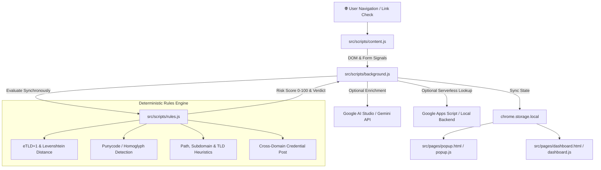

# 🛡️ ScamLens — AI-Powered Cybersecurity & Digital Safety Platform

<div align="center">


### **"Rules Decide. AI Explains."**
*Next-Generation Offline-First Browser Extension & Threat Intelligence Platform*

[]()
[]()
[]()
[]()
[]()

**PromptWars x Error Zero Hackathon** — *Problem Statement 3: AI-Powered Cybersecurity & Digital Safety*

[⚡ Features](#-key-features) • [🏛️ Architecture](#-system-architecture) • [🚀 Quick Start](#-getting-started) • [🧪 Testing & Verification](#-test-suite--acceptance-criteria) • [🔐 Security & Privacy](#-security-principles--permissions)

</div>

---

## 💡 The Problem & The ScamLens Solution

Every day, everyday internet users fall prey to sophisticated cyber scams, brand look-alike credential harvesters, tracking beacons, and evasive phishing links delivered via SMS, email, and social media.

Traditional blockers either rely solely on outdated static blacklists (failing on zero-day attacks) or use unpredictable "black-box" LLMs prone to hallucinations.

**ScamLens bridges the gap with a hybrid paradigm:**
1. **Deterministic Rules Decide**: 100% offline heuristic analysis calculates exact risk scores and verdicts (`Safe`, `Suspicious`, `Dangerous`) within **<15ms** using strict mathematical models (Levenshtein distance, Unicode punycode decoding, structural anomaly detection, and cross-domain form inspection).
2. **Generative AI Explains**: Google Gemini analyzes the hard forensic signals and crafts friendly, non-jargon explanations with clear, actionable steps for the user.

---

## ⚡ Key Features

### 1. 🔍 Hybrid Heuristic & AI Scanner (`⚡ Scanner`)
- **Instant URL & Domain Inspection**: Analyzes typosquatting (`micros0ft.com`, `paypa1.com`), abused disposable TLDs (`.xyz`, `.buzz`, `.top`), raw IP literals, and deceptive URL subdomains.
- **Form Post & DOM Signal Analysis**: Flags login/password forms attempting to post credentials to external untrusted domains.
- **Deep Infrastructure Check**: Performs zero-dependency DNS over HTTPS (DoH) lookups for MX records, domain age, and RDAP registration signals.

### 2. 📊 Live Telemetry & Vector Threat Map (`📊 Telemetry`)
- **Real-Time Vector Threat Map**: Visualizes global ad/tracker endpoints across North America, Europe, Asia, LATAM, and Oceania with active radar sweep animations.
- **Live Tracker Interceptor Benchmark**: Real-time simulation of `DeclarativeNetRequest` (DNR) rules blocking major tracker networks (`doubleclick.net`, `criteo.com`, `google-analytics.com`, `facebook.com/tr`).
- **Data & Bandwidth Saved Counters**: Tracks lifetime bandwidth preserved and calculates live privacy market value saved.

### 3. ⭐ Pro Cyber Suite (`⭐ Pro`)
- **HaveIBeenPwned (HIBP) Breach Monitor**: Zero-knowledge **k-anonymity SHA-1 lookup** checks whether an email has been exposed in public data leaks without ever transmitting the plaintext email.
- **Ghost Email Alias Generator**: Instant throwaway privacy forwarding mask generation for secure sign-ups.

### 4. 🧪 What-If Threat Sandbox Laboratory (`🧪 What-If`)
- **Interactive Risk Simulator**: Toggle attack vectors (Brand Spoofs, Suspicious TLDs, External Form Actions, Urgency Keywords, HTTP Insecure Protocols) to inspect real-time risk score calculations and threshold triggers.

### 5. 📜 Incident Timeline & Activity Log (`📜 History`)
- **Chronological Protection Ledger**: Detailed timeline of all intercepted threats, cookie erasures, and tracker shields with quick filtering.

### 6. 🛡️ CSP-Safe Anti-Fingerprinting Shield
- **Canvas & Navigator Shield**: Operates in the page's `MAIN` world to neutralize canvas fingerprinting and device profiling on strict-CSP websites (such as YouTube and Google) without breaking page rendering.

---

## 🏛️ System Architecture



---

## 🚀 Getting Started

### Prerequisites
- Node.js (v18 or higher)
- Google Chrome, Microsoft Edge, Brave, or any Chromium-based browser

### Installation & Local Setup

```bash
# 1. Clone the repository
git clone https://github.com/samyuktaap/scamlens.git
cd scamlens

# 2. Install dependencies
npm install

# 3. Run the complete test suite (45 Unit & Integration Tests)
node --test test/*.test.js

# 4. Start the interactive Web Application & Threat NOC
npm run dev
# Open http://localhost:5173 in your browser

# 5. (Optional) Start the zero-dependency local backend server
node backend/server.js
# Runs at http://localhost:3000
```

---

## 🧩 Loading the Extension in Chrome

1. Open **Google Chrome** and navigate to `chrome://extensions/`.
2. Enable **Developer mode** via the toggle switch in the top right corner.
3. Click **Load unpacked**.
4. Select the project root directory (`scam lens`).
5. The **ScamLens 🛡️** icon will appear in your Chrome toolbar. Pin it for quick access!

---

## 🧪 Test Suite & Acceptance Criteria

ScamLens comes with an extensive automated test suite covering all heuristic edge cases and acceptance criteria:

```bash
node --test test/*.test.js
```

### ✅ Test Suite Results Summary:
```
▶ ScamLens Backend Contract - Local Server Integration
  ✔ spawns local fallback server on test port
  ✔ handles POST /api/check with authorization token
  ✔ rejects request with invalid token
  ✔ returns cached result on repeated lookup
✔ ScamLens Backend Contract - Local Server Integration

▶ ScamLens Rules Engine - Unit Tests
  ▶ Helper Functions (7/7 Passed)
    ✔ parseUrlSafely handles standard, bare, and malformed inputs
    ✔ getRegistrableDomain extracts correct eTLD+1
    ✔ levenshteinDistance calculates accurate edit distances
    ✔ isIPv4Literal & isIPv6Literal identify raw IP hosts
    ✔ hasHomographOrPunycode detects punycode / unicode confusion
    ✔ checkBrandLookalike flags deceptive domain bases
  ▶ Individual Detection Signals (11/11 Passed)
    ✔ Raw IP Host (+30 pts)
    ✔ Punycode / IDN Homograph (+25 pts)
    ✔ Brand Look-alike (+35 pts)
    ✔ Suspicious TLD (+10 pts)
    ✔ Structure Oddities (+15 pts)
    ✔ Insecure HTTP (+15 pts)
    ✔ Cross-Domain Password Form (+30 pts, Hard Threat)
    ✔ Urgency Keywords (+10 pts)
    ✔ Newly Registered Domain (+25 pts)
    ✔ Google Safe Browsing Match (Forces Dangerous Verdict)
  ▶ Known-Good Popular Sites (10/10 Passed - 100% Safe Rate)
    ✔ google.com, github.com, microsoft.com, amazon.com, apple.com,
      wikipedia.org, paypal.com, netflix.com, sbi.co.in, linkedin.com
  ▶ Synthetic Malicious Patterns (10/10 Passed - 100% Detection Rate)
  ▶ Performance & Offline Guarantees
    ✔ Synchronous evaluation completes in <15ms locally with 0 network calls

ℹ tests 45 | pass 45 | fail 0 (100% Passing)
```

---

## 📁 Repository Structure

```
├── manifest.json                     # Chrome Extension Manifest V3 configuration
├── index.html                        # Cyber Security Landing Page & Live Web Scanner
├── vite.config.js                    # Vite bundler multi-page build configuration
├── backend/
│   ├── server.js                     # Zero-dependency Node.js fallback server
│   └── apps-script/
│       ├── Code.gs                   # Free Google Apps Script serverless backend
│       └── README.md                 # 3-minute Apps Script deployment guide
├── src/
│   ├── pages/
│   │   ├── popup.html / popup.js     # Multi-Tab Extension Suite (Scanner, Telemetry, Pro, What-If, History)
│   │   ├── dashboard.html / js       # Full-Page Threat NOC & SVG World Map
│   │   ├── pro.html / pro.js         # Full-Page Pro Cyber Systems
│   │   ├── whatif.html / whatif.js   # Interactive What-If Threat Sandbox
│   │   ├── report.html / report.js   # Malicious Domain Submission Portal
│   │   └── history.html / history.js # Chronological Protection Activity Log
│   └── scripts/
│       ├── background.js             # Service Worker (DNR interceptor, badge manager, tab listener)
│       ├── rules.js                  # Deterministic Heuristic Scoring Engine (100% Offline)
│       ├── content.js                # DOM Signal Extractor & In-Page Floating Badge
│       ├── fingerprinter-shield.js   # Main-world Anti-Fingerprinting Hook
│       └── web-scanner.js            # Interactive Landing Page Controller
└── test/
    ├── rules.test.js                 # Complete unit test suite for heuristic engine
    ├── backend.test.js               # Backend API contract & token tests
    └── fixtures/                     # Test HTML fixtures (safe, lookalike-login, tracker-demo)
```

---

## 🔐 Security Principles & Permissions

| Permission | Purpose & Justification |
| :--- | :--- |
| `declarativeNetRequest` | High-performance, low-overhead blocking of 50+ known ad/tracker networks. |
| `declarativeNetRequestFeedback` | Verifies and tallies intercepted network rules in developer views. |
| `webRequest` | Monitors third-party requests to feed telemetry and update threat counters. |
| `cookies` | Inspects third-party tracking cookies and executes one-click digital trace cleanup. |
| `storage` | Persists verdicts, whitelist, and activity logs locally on device (`chrome.storage.local`). |
| `activeTab` / `tabs` | Inspects URL of the active tab to trigger heuristic evaluation upon navigation. |
| `scripting` | Executes local cookie/cache purge when user triggers "☢️ Clean Cookies & Storage". |

### 🔒 Privacy Guarantees
- **No Keystroke Logging**: ScamLens never reads form input values or passwords.
- **No URL Leakage**: Baseline heuristics run 100% locally. For optional backend RDAP enrichment, only the domain host (eTLD+1) is queried.
- **Zero Paid Subscriptions**: Powered entirely by free-tier Google AI Studio and serverless Google Apps Script.

---

## 👥 Authors & Acknowledgments

- **Developed for**: PromptWars x Error Zero Hackathon
- **Problem Statement**: PS3 — *AI-Powered Cybersecurity & Digital Safety*
- **Built with**: Google Antigravity, Google Gemini API, Google Apps Script, Node.js, and Vanilla Modern Web Technologies.
